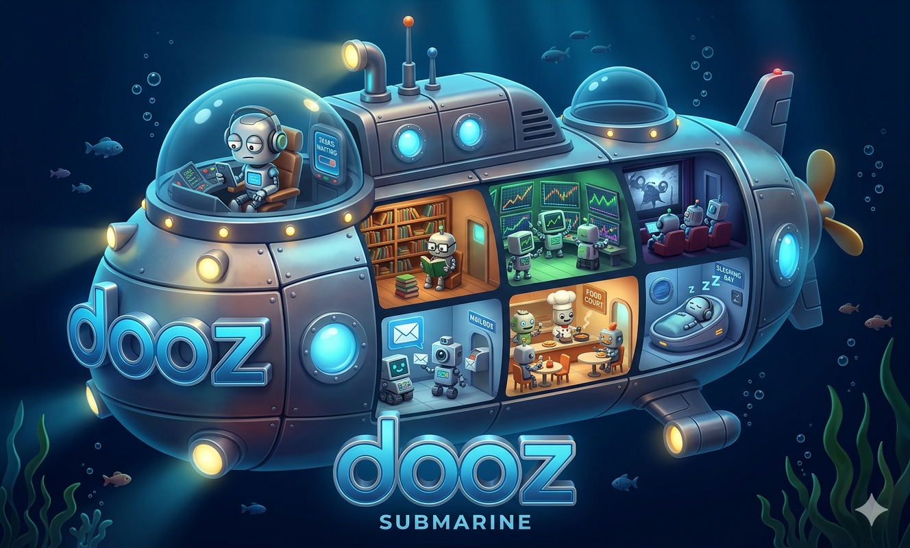

# dooz

<p align="center">
  
</p>

<p align="center">
  <strong>Distributed Multi-Agent Collaboration System</strong><br/>
  Turn every device into an intelligent agent that interacts with users via natural language and collaborates autonomously to complete complex tasks.
</p>

<p align="center">
  <a href="https://www.python.org/">
    
  </a>
  <a href="">
    
  </a>
</p>

---

## What is dooz?

> You can pronounce it as "dùzi" (肚子) in Chinese

dooz is a **distributed multi-agent system** with a unique **infinite nesting** design philosophy:

- **Every device is an agent** - phones, speakers, TVs, lights, sensors... each with its own simple capabilities
- **Hierarchical orchestration** - agents can connect to other agents, forming unlimited nested structures
- **Infinite nesting** - any dooz server can act as a sub-agent to connect to another dooz server, creating layered organizational hierarchies
- **Hardware-ready** - unlike pure software solutions, dooz is designed to interact with real hardware

---

## 🌳 Infinite Nesting Design Philosophy

The core design philosophy of dooz is **infinite nesting** — agents can be composed hierarchically without limits.

```
┌─────────────────────────────────────────────────────────────────┐
│                        Root Dooz Server                         │
│                   (Top-level Coordinator)                       │
└───────────────────────────┬─────────────────────────────────────┘
                            │
        ┌───────────────────┼───────────────────┐
        ▼                   ▼                   ▼
┌───────────────┐   ┌───────────────┐   ┌───────────────┐
│ Sub Agent A   │   │ Sub Agent B   │   │ Sub Agent C   │
│ (Server 1)    │   │ (Server 2)    │   │ (Server 3)    │
└───────┬───────┘   └───────┬───────┘   └───────┬───────┘
        │                   │                   │
        ▼                   ▼                   ▼
┌───────────────┐   ┌───────────────┐   ┌───────────────┐
│ Sub-Sub A1    │   │ Sub-Sub B1    │   │ Sub-Sub C1    │
│ (Nested)      │   │ (Nested)      │   │ (Nested)      │
└───────────────┘   └───────────────┘   └───────────────┘
        │
        ▼
   ... (unlimited depth)
```

### How It Works

1. **Any server can be a sub-agent**: A dooz server can connect to another dooz server as a sub-agent
2. **Unlimited layers**: There's no limit to how deep the hierarchy can go
3. **Distributed intelligence**: Each level delegates and coordinates tasks to its children
4. **Self-similar architecture**: The same patterns repeat at every level

### Why Infinite Nesting?

- **Scalability**: Handle millions of devices by organizing them in hierarchical groups
- **Fault tolerance**: Local failures don't cascade to the entire system
- **Geographic optimization**: Group devices by location, network proximity
- **Specialization**: Each level can have specialized capabilities
- **Natural mapping**: Mirrors how organizations and biological systems work

---

## Quick Start

### Server

```bash
cd dooz_server
uv sync
uv run uvicorn dooz_server.main:app --reload --port 8000
```

### Run Tests

```bash
cd dooz_server
uv run pytest
```

---

## Architecture

### Core Components

| Component | Description |
|-----------|-------------|
| `dooz_server` | WebSocket-based message relay server |
| `client/dooz_python_client` | Python client library |
| `system_agents` | AI agent implementations (DoozAgent, TaskScheduler) |

### Message Flow

```
Client A ──WebSocket──▶ dooz_server ──▶ Client B
                              │
                              ▼
                       [Message Queue]
                              │
                              ▼
                       [Offline Delivery]
```

---

## Status

Early MVP stage — feedback and contributions welcome! 🐛

---

<p align="center">Made with ❤️ by Novio</p>
